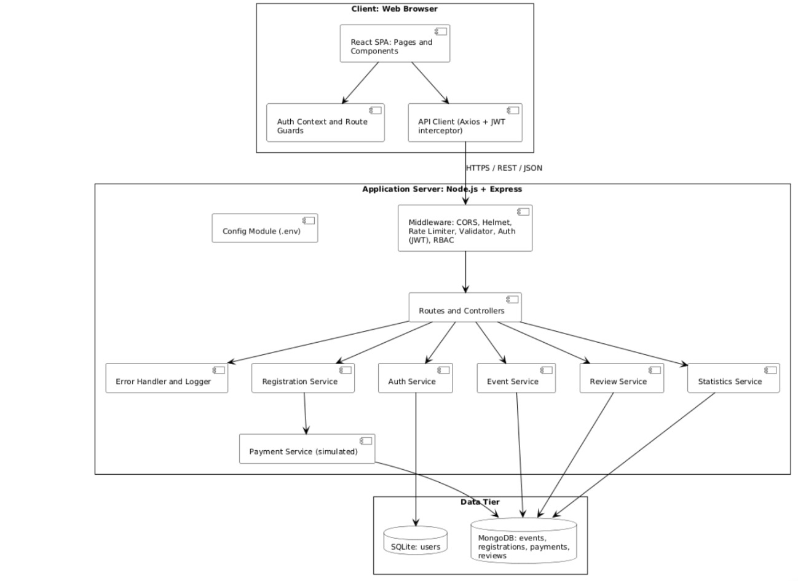
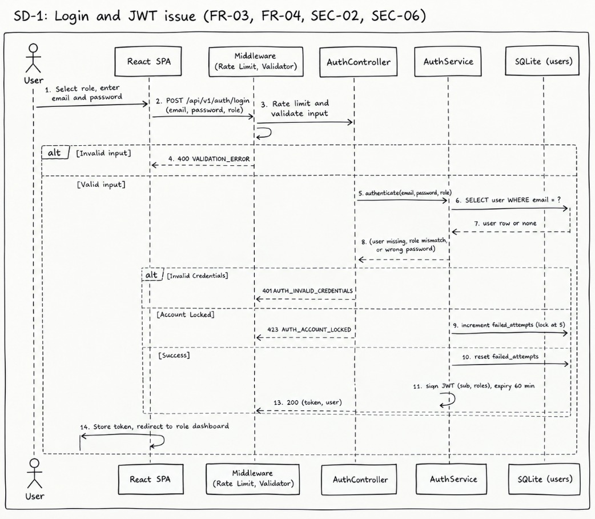
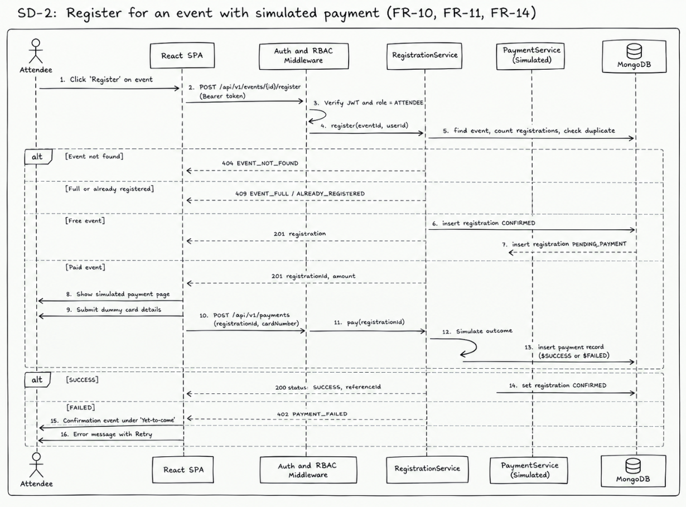
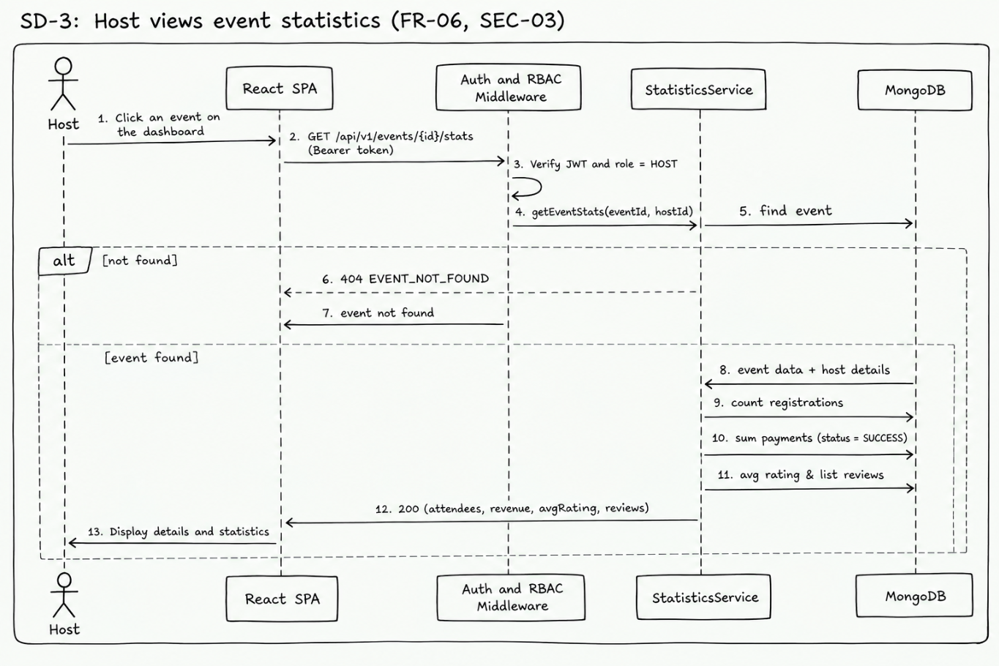

# Software Architecture and Design Specification

## Project: Event Management

**Version:** 1.0  
**Authors:** Piya, Sharanya, Ananya  
**Date:** 28-09-2026  
**Status:** Draft  

---

# Revision History

| Version | Date | Author | Change Summary |
|---|---|---|---|
| 1 | 28/09/2026 | Piya Banerjee | Initial commit |
| 2 | 28/09/2026 | Sharanya R | SRS Document |
| 3 | 28/09/2026 | Ananya U | Test Plan Document |

---

# Approvals

| Role | Name | Signature/Date |
|---|---|---|
| Project Lead | Piya Banerjee | Piya / 28.9.26 |

---

# 1. Introduction

## 1.1 Purpose

This document specifies the architecture and design of the **Event Management System**.

## 1.2 Scope

The system covers the following Event Management services:

- User signup
- User login for both Host and Attendee
- Event creation
- Event search and filtering
- Event registration
- Simulated payment
- Ratings and reviews of events
- Host statistics

**Real payment integration is out of scope.**

## 1.3 Audience

This document is intended for:

- Developers
- QA Engineers
- Security Auditors
- Instructors
- Maintenance Teams

## 1.4 Definitions

| Term | Definition |
|---|---|
| JWT | JSON Web Token |
| RBAC | Role-Based Access Control |
| REST | Representational State Transfer |
| ADR | Architecture Decision Record |
| TLS | Transport Layer Security |
| STRIDE | Spoofing, Tampering, Repudiation, Information Disclosure, Denial of Service, Elevation of Privilege |
| SPA | Single-Page Application |

---

# 2. Document Overview

## 2.1 How to Use This Document

This document provides the major architectural and design deliverables of the Event Management System, including:

- UML diagrams
- Architecture decisions
- Threat modeling
- API design
- Security architecture
- Technology stack
- Requirement traceability

## 2.2 Related Documents

The following documents are related to this specification:

- Software Requirements Specification (SRS)
- Software Test Plan (STP)
- Requirements Traceability Matrix (RTM)

---

# 3. Architecture

## 3.1 Goals & Constraints

### Goals

The system aims to provide:

- Secure authentication and authorization
- Reliable event management
- 99.9% availability
- Recovery from service failures without requiring a complete application restart
- Easy environment configuration
- Maintainable and testable components

### Constraints

The system has the following constraints:

- MERN-based application architecture
- JWT-based authentication
- SQLite for authentication data
- MongoDB for application data
- REST APIs over HTTPS
- Simulated payment instead of actual payment gateway integration
- Approximately 100 concurrent users

---

## 3.2 Stakeholders & Concerns

| Stakeholder | Concerns |
|---|---|
| Hosts | Event creation and management, event statistics, revenue |
| Attendees | Event discovery, registration, payment, account privacy |
| Platform Operators | Maintainability, deployment, configuration |
| Developers | Modularity, testability, security |

---

## 3.3 Component (UML) Diagram



The component diagram represents the major components of the Event Management System and their interactions.

---

## 3.4 Component Descriptions

### React UI

The React UI is responsible for:

- Front landing page
- User signup and login
- Separation of Host and Attendee roles
- Host dashboards
- Attendee dashboards
- Event details
- Payment page
- Attendee reviews

### Auth Service

The Auth Service is responsible for:

- User authentication
- Input validation
- Role-based authentication
- JWT issuance and storage
- Route protection
- Password hashing using bcrypt
- SQLite-based authentication data storage
- API rate limiting

### Event and Registration Processor

The Event and Registration Processor handles:

- Event creation
- Event editing
- Searching and filtering suitable events
- Registration management
- Registration viewing
- Lists of events for attendees and hosts

### Review, Statistics and Payment Processor

This component handles:

- Event reviews
- Event ratings
- Host statistics
- Review eligibility verification
- Simulated payment processing
- Payment status handling

### Backend API

The Backend API is responsible for:

- Communication between the UI and backend services
- Request and response handling
- Error handling
- Error logging
- Security middleware
- API-level validation and authorization

### Database

The databases store:

- User details
- Event details
- Payment details
- Review details
- Registration and transaction data

### Configuration

The Configuration component maintains:

- Application settings
- Environment variables
- Service configuration

---

## 3.5 Chosen Architecture Pattern and Rationale

### Layered Architecture

A **layered architecture** was chosen to provide a clear separation of concerns between the user interface, middleware, business logic, authentication, and data storage layers.

### Rationale

- Microservices were rejected because they would introduce unnecessary complexity for the expected scale of approximately 100 concurrent users.
- A layered Frontend–Middleware–Backend/Database architecture provides simplicity and lower operational cost.
- Separate databases, using SQLite and MongoDB, isolate authentication credentials from application data.
- JWT was selected because it avoids server-side session storage and supports horizontal scaling.
- Server-side RBAC is used because client-side authorization checks can be bypassed.

---

## 3.6 Technology Stack & Data Stores

| Component | Technology |
|---|---|
| Frontend | React.js |
| Backend | Node.js |
| REST API | Express.js |
| Authentication Database | SQLite |
| Application Database | MongoDB |
| ODM | Mongoose |
| Authentication | JWT / jsonwebtoken |
| Password Hashing | bcrypt |
| Communication | REST API over HTTPS |

---

## 3.7 Risks & Mitigations

| Risk | Mitigation |
|---|---|
| Backend or database downtime due to network failure | Restart policies for services and automatic reconnection with back-off |
| Inconsistent data across databases | Use a common UUID and create MongoDB records only after authentication succeeds |
| SQLite limitations during high load | Replace SQLite with another authentication database without changing the service interface |

---

## 3.8 Traceability to Requirements

| Requirement | Component |
|---|---|
| R1 – Landing page | React UI |
| R2 – User signup/login and role separation | React UI, Auth Service |
| R3 – Role-based authentication and route protection | Auth Service |
| R4 – Host and attendee dashboards | React UI |
| R5 – Event details | React UI |
| R6 – Host event history/upcoming events | Event and Registration Processor |
| R7 – Event statistics | Review, Statistics and Payment Processor |
| R8 – Create/edit events | Event and Registration Processor |
| R9 – Attendee registration history/upcoming events | Event and Registration Processor |
| R10 – Search/filter events | Event and Registration Processor |
| R11 – Event registration | Event and Registration Processor |
| R12 – Simulated payment | React UI, Review, Statistics and Payment Processor |
| R13 – Ratings and reviews | React UI, Review, Statistics and Payment Processor |
| R14 – Logout | React UI, Auth Service |
| R15 – Error handling and retry | Backend API |
| R16 – Performance: indexes and pagination | Event and Registration Processor, Database |
| R17 – Usability | React UI |
| R18 – Compatibility | React UI |
| R19 – Error handling and logging | Backend API |
| R20 – Configuration | Configuration |
| R21 – Password/security validation | Auth Service |
| R22 – Authentication | Auth Service, Backend API |
| R23 – Role-based access control | Auth Service, Backend API |
| R24 – Security middleware | Backend API |
| R25 – Input validation | Auth Service, Backend API |
| R26 – Login security | Auth Service, Backend API |

---

## 3.9 Security Architecture

### Objective

The security architecture aims to:

- Retain the confidentiality of user credentials
- Maintain the integrity of events, registrations, payments, and other system data
- Prevent unauthorized external attacks
- Protect resources through authentication and authorization

### Threat Modeling – STRIDE

| Threat | Security Measure |
|---|---|
| **Spoofing** | bcrypt password hashing, account lockout after 5 failed attempts, JWT with fixed algorithm and expiry |
| **Tampering** | JWT signature verification, schema validation, HTTPS |
| **Repudiation** | Logging of important transactions and backend operations |
| **Information Disclosure** | TLS and controlled authentication error messages |
| **Denial of Service** | API rate limiting and pagination limits |
| **Elevation of Privilege** | Server-side RBAC and ownership checks for protected resources |

---

# 4. Design

## 4.1 Design Overview

The Event Management System is designed using a layered architecture with separate frontend, backend, authentication, event management, review, statistics, payment, and database components.

The design separates:

- User interface responsibilities
- Business logic
- Authentication
- Data storage
- Security functions
- Configuration

This separation improves:

- Maintainability
- Testability
- Security
- Scalability
- Modularity

---

## 4.2 UML Sequence Diagrams

 





The sequence diagrams illustrate the interaction between users, the React frontend, backend APIs, authentication services, event management services, payment processing, and databases.

---

# 4.3 API Design

## 4.3.1 API 1 – Login

### Endpoint

```text
/api/auth/login#
# 4.3 API Design

### 4.3.1 API 1 – Login

**Endpoint:**

```text
/api/auth/login
```

**Method:**

```text
POST
```

**Request:**

```json
{
  "role": "attendee",
  "email": "user@example.com",
  "password": "password"
}
```

**Response:**

```json
{
  "status": "success",
  "token": "<JWT>"
}
```

**Errors:**

| Status Code | Description         |
| ----------- | ------------------- |
| 401         | Invalid credentials |
| 400         | Invalid request     |

---

### 4.3.2 API 2 – Event Registration

**Endpoint:**

```text
/api/events/:eventId/register
```

**Method:**

```text
POST
```

**Request:**

```json
{
  "paymentStatus": "success"
}
```

**Response:**

```json
{
  "status": "success",
  "message": "Event registered successfully"
}
```

**Errors:**

| Status Code | Description         |
| ----------- | ------------------- |
| 401         | Unauthorized        |
| 404         | Event not found     |
| 400         | Registration failed |

---

## 4.4 Error Handling, Logging & Monitoring

The system shall provide standardized error messages for the following conditions:

* Authentication failures
* Unavailable backend services
* Unavailable database services
* Invalid requests
* Event-not-found errors
* Registration failures
* Simulated payment failures

Sensitive authentication information such as passwords and JWT secrets shall **not** be included in logs.

Backend errors and important transaction failures shall be logged for debugging and monitoring.

The system shall allow retry of appropriate operations without requiring a complete application restart.

---

## 4.5 UX Design

The Event Management System provides a responsive web-based user interface for both **Hosts** and **Attendees**.

The interface includes:

* Separate dashboards based on user roles
* Clear navigation between past and upcoming events
* Event discovery
* Event search and filtering
* Event registration
* Simulated payment
* Ratings and reviews
* Event details
* Host statistics

The interface is designed to be intuitive and accessible through modern web browsers.

---

## 4.6 Open Issues & Next Steps

Future enhancements may include:

1. Integration with real payment gateways such as Razorpay or Stripe.
2. Native Android or iOS applications.
3. Advanced event recommendation and personalization mechanisms.
4. Additional third-party service integrations.
5. Advanced analytics and reporting.

---

# 5. Appendices

## 5.1 Glossary

| Term   | Definition                                                                                          |
| ------ | --------------------------------------------------------------------------------------------------- |
| JWT    | JSON Web Token                                                                                      |
| RBAC   | Role-Based Access Control                                                                           |
| REST   | Representational State Transfer                                                                     |
| ADR    | Architecture Decision Record                                                                        |
| TLS    | Transport Layer Security                                                                            |
| STRIDE | Spoofing, Tampering, Repudiation, Information Disclosure, Denial of Service, Elevation of Privilege |
| SPA    | Single-Page Application                                                                             |

---

## 5.2 References

* Software Requirements Specification (SRS) – Event Management System
* Software Test Plan (STP) – Event Management System
* Requirements Traceability Matrix (RTM)
* IEEE 42010
* OWASP
* NIST SP 800-160

---

## 5.3 Tools

| Tool       | Purpose                       |
| ---------- | ----------------------------- |
| Excalidraw | UML diagrams                  |
| draw.io    | Architecture and UML diagrams |
| Postman    | API testing                   |
| Git/GitHub | Version control               |

---


